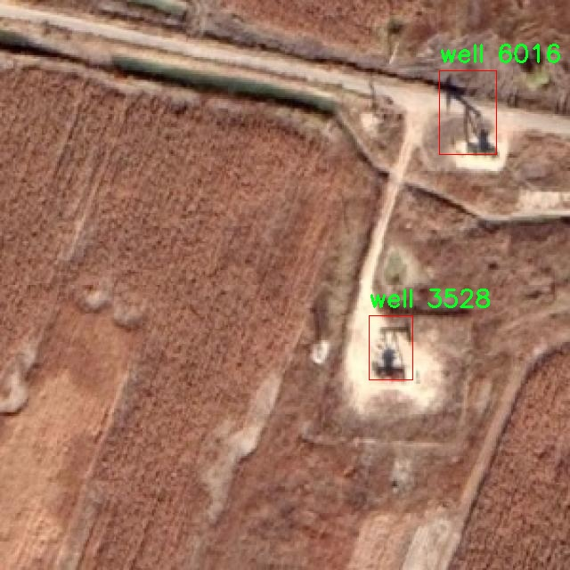

# 油井检测检测系统源码分享
 # [一条龙教学YOLOV8标注好的数据集一键训练_70+全套改进创新点发刊_Web前端展示]

### 1.研究背景与意义

项目参考[AAAI Association for the Advancement of Artificial Intelligence](https://gitee.com/qunmasj/projects)

项目来源[AACV Association for the Advancement of Computer Vision](https://kdocs.cn/l/cszuIiCKVNis)

研究背景与意义

随着全球能源需求的不断增长，石油作为重要的能源资源，其开采和管理变得愈发重要。油井的检测与监控不仅关系到油田的生产效率，还直接影响到环境保护和资源的可持续利用。传统的油井检测方法往往依赖人工巡检，效率低下且容易受到人为因素的影响，无法满足现代化油田管理的需求。因此，基于计算机视觉和深度学习技术的自动化油井检测系统应运而生，成为提升油田管理效率的重要手段。

近年来，YOLO（You Only Look Once）系列目标检测算法因其高效性和实时性而受到广泛关注。YOLOv8作为该系列的最新版本，进一步提升了检测精度和速度，适用于各种复杂场景的目标检测任务。然而，针对油井检测这一特定应用场景，YOLOv8仍然面临着一些挑战，如数据集的稀缺性、油井图像的多样性及环境因素的影响等。因此，改进YOLOv8以适应油井检测的需求，不仅具有重要的学术价值，也为实际应用提供了新的解决方案。

本研究的核心在于基于改进YOLOv8的油井检测系统，利用一个包含3500张油井图像的数据集进行训练和测试。该数据集专注于油井这一特定类别，涵盖了不同的拍摄角度、光照条件和背景环境，旨在提高模型对油井目标的识别能力。通过对YOLOv8的改进，我们希望能够增强其在油井检测中的表现，特别是在小目标检测和复杂背景下的鲁棒性。

本研究的意义不仅在于技术上的创新，更在于其对油田管理实践的推动。通过实现高效、准确的油井检测系统，可以大幅度降低人工巡检的成本，提高油田的管理效率。此外，自动化的检测系统能够实时监控油井的状态，及时发现潜在的安全隐患，从而减少环境污染和资源浪费，促进可持续发展。

在理论层面，本研究将为目标检测领域提供新的思路和方法，特别是在特定领域应用中的模型改进与优化方面。通过对YOLOv8的改进，我们将探索深度学习模型在特定任务中的适应性与灵活性，为后续研究提供参考。

综上所述，基于改进YOLOv8的油井检测系统的研究，不仅具有重要的学术价值和应用前景，还将为石油行业的数字化转型和智能化管理提供有力支持。通过提升油井检测的自动化水平，我们期待能够为油田的可持续发展贡献一份力量。

### 2.图片演示


##### 注意：由于此博客编辑较早，上面“2.图片演示”和“3.视频演示”展示的系统图片或者视频可能为老版本，新版本在老版本的基础上升级如下：（实际效果以升级的新版本为准）

  （1）适配了YOLOV8的“目标检测”模型和“实例分割”模型，通过加载相应的权重（.pt）文件即可自适应加载模型。

  （2）支持“图片识别”、“视频识别”、“摄像头实时识别”三种识别模式。

  （3）支持“图片识别”、“视频识别”、“摄像头实时识别”三种识别结果保存导出，解决手动导出（容易卡顿出现爆内存）存在的问题，识别完自动保存结果并导出到tempDir中。

  （4）支持Web前端系统中的标题、背景图等自定义修改，后面提供修改教程。

  另外本项目提供训练的数据集和训练教程,暂不提供权重文件（best.pt）,需要您按照教程进行训练后实现图片演示和Web前端界面演示的效果。

### 3.视频演示

[3.1 视频演示](https://www.bilibili.com/video/BV1npsCe5ER1/)

### 4.数据集信息展示

##### 4.1 本项目数据集详细数据（类别数＆类别名）

nc: 1
names: ['well']


##### 4.2 本项目数据集信息介绍

数据集信息展示

在本研究中，我们使用了名为“oilwell”的数据集，旨在改进YOLOv8模型在油井检测系统中的性能。该数据集专门为油井检测任务而设计，具有独特的应用价值和研究意义。数据集的类别数量为1，具体类别为“well”，这意味着所有标注的图像均围绕这一单一类别展开，确保了模型在特定任务上的专注性和准确性。

“oilwell”数据集的构建过程涉及了多种数据采集和标注技术，确保了数据的多样性和代表性。数据集中的图像来源于不同的油田环境，涵盖了多种光照条件、天气变化以及不同角度的拍摄。这种多样性不仅提高了模型的鲁棒性，也使得其在实际应用中能够更好地适应各种复杂的场景。数据集中包含的图像经过精心挑选和标注，确保每一张图像都能准确反映油井的特征，为模型的训练提供了高质量的输入。

在数据集的标注过程中，采用了先进的图像标注工具，确保了标注的准确性和一致性。每一张图像中的油井都被清晰地框定，标注信息包括油井的位置信息和类别标签。由于数据集仅包含一个类别，模型在训练过程中能够专注于油井的特征提取，从而提高检测的精度和效率。这种专一性使得“oilwell”数据集在油井检测领域中具有重要的应用潜力。

为了进一步增强数据集的实用性，研究团队还对数据进行了增强处理，包括旋转、缩放、裁剪和颜色调整等操作。这些数据增强技术不仅丰富了数据集的多样性，还有效提高了模型的泛化能力，使其在面对未见过的油井图像时依然能够保持较高的检测性能。此外，数据集的构建过程中还考虑到了实际应用中的挑战，如油井的遮挡、背景复杂性等，这些因素都被纳入了数据集的设计中。

“oilwell”数据集的应用不仅限于模型的训练，还可以用于后续的验证和测试阶段。通过在不同的测试集上评估模型的性能，研究人员能够获得关于模型在实际应用中表现的全面反馈。这种反馈机制将有助于不断优化和改进YOLOv8模型，最终实现更高效的油井检测系统。

总之，“oilwell”数据集为改进YOLOv8在油井检测任务中的应用提供了坚实的基础。其丰富的图像数据和高质量的标注信息将极大地推动油井检测技术的发展，助力相关领域的研究与实践。通过对该数据集的深入分析和应用，我们期待能够在油井检测的准确性和效率上取得显著进展，为油气行业的智能化发展贡献力量。




### 5.全套项目环境部署视频教程（零基础手把手教学）

[5.1 环境部署教程链接（零基础手把手教学）](https://www.ixigua.com/7404473917358506534?logTag=c807d0cbc21c0ef59de5)


[5.2 安装Python虚拟环境创建和依赖库安装视频教程链接（零基础手把手教学）](https://www.ixigua.com/7404474678003106304?logTag=1f1041108cd1f708b01a)

### 6.手把手YOLOV8训练视频教程（零基础小白有手就能学会）

[6.1 手把手YOLOV8训练视频教程（零基础小白有手就能学会）](https://www.ixigua.com/7404477157818401292?logTag=d31a2dfd1983c9668658)

### 7.70+种全套YOLOV8创新点代码加载调参视频教程（一键加载写好的改进模型的配置文件）

[7.1 70+种全套YOLOV8创新点代码加载调参视频教程（一键加载写好的改进模型的配置文件）](https://www.ixigua.com/7404478314661806627?logTag=29066f8288e3f4eea3a4)

### 8.70+种全套YOLOV8创新点原理讲解（非科班也可以轻松写刊发刊，V10版本正在科研待更新）

由于篇幅限制，每个创新点的具体原理讲解就不一一展开，具体见下列网址中的创新点对应子项目的技术原理博客网址【Blog】：


[8.1 70+种全套YOLOV8创新点原理讲解链接](https://gitee.com/qunmasj/good)

### 9.系统功能展示（检测对象为举例，实际内容以本项目数据集为准）

图9.1.系统支持检测结果表格显示

  图9.2.系统支持置信度和IOU阈值手动调节

  图9.3.系统支持自定义加载权重文件best.pt(需要你通过步骤5中训练获得)

  图9.4.系统支持摄像头实时识别

  图9.5.系统支持图片识别

  图9.6.系统支持视频识别

  图9.7.系统支持识别结果文件自动保存

  图9.8.系统支持Excel导出检测结果数据


### 10.原始YOLOV8算法原理

原始YOLOv8算法原理

YOLOv8算法是由Ultralytics公司于2023年发布的YOLO系列最新版本，作为YOLO系列的继承者，YOLOv8在多个方面进行了创新和改进，旨在提升目标检测的效率和准确性。YOLOv8的设计理念依然遵循了YOLO系列的核心思想，即实时性和高效性，然而在实现上却引入了许多新的技术和结构，以适应日益复杂的计算机视觉任务。

首先，YOLOv8在数据预处理方面延续了YOLOv5的策略，采用了多种数据增强技术，包括马赛克增强、混合增强、空间扰动和颜色扰动等。这些增强手段不仅提高了模型的鲁棒性，还能有效扩展训练数据集的多样性，使得模型在面对不同场景和光照条件时，依然能够保持较高的检测性能。

在骨干网络结构方面，YOLOv8的设计借鉴了YOLOv5的主干网络架构，整体结构清晰且具有良好的可扩展性。YOLOv8将原有的C3模块替换为新的C2f模块，这一改进显著增强了特征提取的能力。C2f模块通过引入更多的分支结构，丰富了梯度回传时的支流，使得网络在学习过程中能够更好地捕捉到不同层次的特征信息。这种设计不仅提高了特征提取的效率，还增强了模型的表达能力。

YOLOv8还采用了FPN-PAN结构来构建特征金字塔，这一结构使得多尺度信息之间的融合更加充分。尽管FPN-PAN的基本框架与YOLOv5相似，但YOLOv8在其中的C3模块被C2f模块所替代，进一步提升了特征融合的效果。这种结构的优势在于，它能够有效地处理不同尺度的目标，使得模型在面对各种大小的物体时，依然能够保持较高的检测精度。

在检测头的设计上，YOLOv8采用了解耦头结构，这一结构的引入使得分类和定位任务可以在不同的分支中独立进行，从而提高了模型的灵活性和准确性。与传统的耦合头相比，解耦头能够更好地处理复杂的目标检测任务，尤其是在目标密集的场景中，解耦头的优势愈加明显。此外，YOLOv8采用了Anchor-Free的检测方式，进一步简化了模型的设计，减少了对预定义锚框的依赖，使得模型在处理不同形状和大小的目标时，能够更加自适应。

在标签分配策略方面，YOLOv8引入了动态标签分配策略，取代了YOLOv5中依赖于数据集的候选框聚类方法。这一策略通过使用目标框和目标分数来进行标签分配，避免了因数据集不足而导致的标签不准确问题。YOLOv8的损失函数设计也有所创新，采用了Varifocal Loss作为分类损失，并结合CIoU Loss与DFL Loss作为回归损失。这种损失函数的设计旨在更好地平衡正负样本的贡献，尤其是在处理高质量正样本时，能够有效提升模型的性能。

总的来说，YOLOv8算法在多个方面进行了创新和改进，尤其是在网络结构、数据处理和损失函数等方面的优化，使得其在目标检测任务中表现出色。通过引入C2f模块、解耦头结构和动态标签分配策略，YOLOv8不仅提升了模型的准确性和鲁棒性，还增强了其在实时检测中的应用潜力。这些改进使得YOLOv8在计算机视觉领域的目标检测任务中，成为了一个值得关注的重要进展。随着YOLOv8的推出，目标检测技术将迎来新的发展机遇，为各类应用场景提供更加高效和精准的解决方案。


### 11.项目核心源码讲解（再也不用担心看不懂代码逻辑）

#### 11.1 ui.py

以下是经过简化和注释的核心代码部分：

```python
import sys
import subprocess

def run_script(script_path):
    """
    使用当前 Python 环境运行指定的脚本。

    Args:
        script_path (str): 要运行的脚本路径
    """
    # 获取当前 Python 解释器的路径
    python_path = sys.executable

    # 构建运行命令，使用 streamlit 运行指定的脚本
    command = f'"{python_path}" -m streamlit run "{script_path}"'

    # 执行命令并等待其完成
    result = subprocess.run(command, shell=True)
    
    # 检查命令执行结果，如果返回码不为0，则表示出错
    if result.returncode != 0:
        print("脚本运行出错。")

# 主程序入口
if __name__ == "__main__":
    # 指定要运行的脚本路径
    script_path = "web.py"  # 这里可以直接指定脚本名称

    # 调用函数运行脚本
    run_script(script_path)
```

### 代码注释说明：
1. **导入模块**：
   - `sys`：用于获取当前 Python 解释器的路径。
   - `subprocess`：用于执行外部命令。

2. **`run_script` 函数**：
   - 该函数接受一个脚本路径作为参数，并使用当前 Python 环境运行该脚本。
   - 使用 `sys.executable` 获取当前 Python 解释器的路径，以确保脚本在正确的环境中运行。
   - 构建命令字符串，使用 `streamlit` 模块运行指定的脚本。
   - 使用 `subprocess.run` 执行命令，并等待其完成。
   - 检查命令的返回码，如果不为0，表示脚本运行出错，并打印错误信息。

3. **主程序入口**：
   - 使用 `if __name__ == "__main__":` 确保该代码块仅在直接运行脚本时执行。
   - 指定要运行的脚本路径（在这里直接指定为 `"web.py"`）。
   - 调用 `run_script` 函数以运行指定的脚本。

这个文件是一个名为 `ui.py` 的 Python 脚本，主要功能是通过当前的 Python 环境来运行一个指定的脚本。首先，文件导入了几个必要的模块，包括 `sys`、`os` 和 `subprocess`，这些模块提供了与系统交互和执行外部命令的功能。此外，还导入了 `abs_path` 函数，该函数来自 `QtFusion.path` 模块，用于获取文件的绝对路径。

在 `ui.py` 中，定义了一个名为 `run_script` 的函数，该函数接受一个参数 `script_path`，表示要运行的脚本的路径。函数内部首先获取当前 Python 解释器的路径，接着构建一个命令字符串，这个命令使用 `streamlit` 模块来运行指定的脚本。`streamlit` 是一个用于构建数据应用的库。

随后，使用 `subprocess.run` 方法执行构建好的命令。如果命令执行的返回码不为零，表示脚本运行过程中出现了错误，程序会打印出“脚本运行出错”的提示信息。

在文件的最后部分，使用 `if __name__ == "__main__":` 语句来确保当脚本作为主程序运行时，下面的代码才会被执行。在这里，指定了要运行的脚本路径为 `web.py`，并调用 `run_script` 函数来执行这个脚本。

总的来说，这个 `ui.py` 文件的主要作用是提供一个简单的接口，通过命令行来运行一个 Streamlit 应用脚本 `web.py`，并处理可能出现的错误。

#### 11.2 code\ultralytics\data\explorer\__init__.py

以下是保留的核心代码部分，并附上详细的中文注释：

```python
# 导入必要的工具函数
from .utils import plot_query_result

# 定义模块的公开接口，允许外部访问的内容
__all__ = ["plot_query_result"]
```

### 代码注释说明：

1. `from .utils import plot_query_result`：
   - 这一行代码从当前包的 `utils` 模块中导入了 `plot_query_result` 函数。这里的 `.` 表示当前目录，意味着 `utils` 是与当前模块同级的一个模块。
   - `plot_query_result` 可能是一个用于绘制查询结果的函数，具体功能需要查看 `utils` 模块的实现。

2. `__all__ = ["plot_query_result"]`：
   - 这一行定义了模块的 `__all__` 变量，它是一个列表，指定了当使用 `from module import *` 语句时，哪些名称是可以被导入的。
   - 在这里，只有 `plot_query_result` 被列入 `__all__`，这意味着其他未列出的名称将不会被导入，帮助控制模块的公共接口，避免不必要的名称暴露。

这个程序文件是一个Python模块，属于Ultralytics YOLO项目的一部分，遵循AGPL-3.0许可证。文件的主要功能是导入和暴露一个名为`plot_query_result`的函数，来自同一目录下的`utils`模块。

在文件的开头，有一个注释行，标明了该项目的名称“Ultralytics YOLO”以及所使用的许可证类型。这种注释通常用于提供项目的基本信息，便于其他开发者了解该代码的来源和使用条款。

接下来，文件通过`from .utils import plot_query_result`语句导入了`utils`模块中的`plot_query_result`函数。这里的`.`表示当前目录，表明`utils`模块与当前文件在同一层级。

最后，`__all__`变量被定义为一个列表，包含了`plot_query_result`。这个变量的作用是指明当使用`from module import *`语句时，哪些名称是可以被导入的。这是一种控制模块导出接口的方式，帮助其他开发者清楚地知道哪些功能是模块的公共接口。

总体而言，这个文件的结构简单明了，主要是为了组织和管理代码，使得`plot_query_result`函数可以被其他模块方便地使用。

#### 11.3 70+种YOLOv8算法改进源码大全和调试加载训练教程（非必要）\ultralytics\nn\autobackend.py

以下是经过简化并注释的核心代码部分，主要集中在 `AutoBackend` 类的初始化和推理过程：

```python
import torch
import torch.nn as nn
import cv2
import numpy as np
from pathlib import Path
from ultralytics.utils import LOGGER, yaml_load
from ultralytics.utils.downloads import attempt_download_asset

class AutoBackend(nn.Module):
    """
    处理 Ultralytics YOLO 模型的动态后端选择。
    """

    @torch.no_grad()
    def __init__(self, weights='yolov8n.pt', device=torch.device('cpu'), dnn=False, data=None, fp16=False, fuse=True, verbose=True):
        """
        初始化 AutoBackend 进行推理。

        参数:
            weights (str): 模型权重文件的路径，默认为 'yolov8n.pt'。
            device (torch.device): 运行模型的设备，默认为 CPU。
            dnn (bool): 是否使用 OpenCV DNN 模块进行 ONNX 推理，默认为 False。
            data (str | Path | optional): 包含类名的额外 data.yaml 文件的路径，默认为 None。
            fp16 (bool): 是否启用半精度推理，默认为 False。
            fuse (bool): 是否融合 Conv2D + BatchNorm 层以优化，默认为 True。
            verbose (bool): 是否启用详细日志，默认为 True。
        """
        super().__init__()
        w = str(weights[0] if isinstance(weights, list) else weights)  # 处理权重路径
        model_type = self._model_type(w)  # 确定模型类型
        self.fp16 = fp16  # 半精度标志
        self.device = device  # 设备设置

        # 下载模型权重（如果不是本地文件）
        if not model_type[0]:  # 如果不是 PyTorch 模型
            w = attempt_download_asset(w)

        # 加载模型
        if model_type[0]:  # 如果是 PyTorch 模型
            from ultralytics.nn.tasks import attempt_load_weights
            self.model = attempt_load_weights(w, device=device, inplace=True, fuse=fuse)
        elif model_type[1]:  # TorchScript
            self.model = torch.jit.load(w, map_location=device)
        elif dnn:  # ONNX OpenCV DNN
            self.net = cv2.dnn.readNetFromONNX(w)
        elif model_type[2]:  # ONNX Runtime
            import onnxruntime
            self.session = onnxruntime.InferenceSession(w)
        # 其他模型类型的加载省略...

        # 加载外部元数据 YAML
        metadata = self._load_metadata(weights)
        self.names = self._check_class_names(metadata.get('names', data))

    def forward(self, im, augment=False, visualize=False):
        """
        对 YOLOv8 MultiBackend 模型进行推理。

        参数:
            im (torch.Tensor): 要进行推理的图像张量。
            augment (bool): 是否在推理过程中进行数据增强，默认为 False。
            visualize (bool): 是否可视化输出预测，默认为 False。

        返回:
            (tuple): 包含原始输出张量和处理后的输出（如果 visualize=True）。
        """
        if self.fp16 and im.dtype != torch.float16:
            im = im.half()  # 转换为 FP16
        # 根据模型类型进行推理
        if self.model:  # PyTorch
            y = self.model(im, augment=augment, visualize=visualize)
        elif self.dnn:  # ONNX OpenCV DNN
            im = im.cpu().numpy()  # 转换为 numpy
            self.net.setInput(im)
            y = self.net.forward()
        elif self.session:  # ONNX Runtime
            im = im.cpu().numpy()  # 转换为 numpy
            y = self.session.run(None, {self.session.get_inputs()[0].name: im})
        # 其他推理方式省略...

        return y  # 返回推理结果

    @staticmethod
    def _model_type(p='path/to/model.pt'):
        """
        根据模型文件路径返回模型类型。

        参数:
            p: 模型文件的路径，默认为 'path/to/model.pt'。
        """
        # 省略具体实现...
        return model_types  # 返回模型类型列表

    def _load_metadata(self, weights):
        """
        加载模型的元数据。

        参数:
            weights: 模型权重路径。

        返回:
            metadata: 加载的元数据。
        """
        # 省略具体实现...
        return metadata

    def _check_class_names(self, names):
        """
        检查类名的有效性。

        参数:
            names: 类名列表或字典。

        返回:
            names: 处理后的类名字典。
        """
        # 省略具体实现...
        return names
```

### 代码说明：
1. **类定义**：`AutoBackend` 类用于处理不同模型格式的推理。
2. **初始化方法**：在 `__init__` 方法中，模型权重会被加载，并根据不同的模型类型（如 PyTorch、ONNX 等）进行初始化。
3. **推理方法**：`forward` 方法用于执行推理，根据输入的图像张量和模型类型返回推理结果。
4. **辅助方法**：包括 `_model_type` 用于确定模型类型，`_load_metadata` 用于加载模型的元数据，以及 `_check_class_names` 用于验证类名的有效性。

通过这种方式，代码的核心逻辑得以保留，同时也提供了详细的中文注释以帮助理解。

这个程序文件是Ultralytics YOLOv8模型的一个核心部分，主要负责动态选择后端以进行推理。文件中包含了多个导入的库和模块，提供了必要的功能支持，如图像处理、模型加载和推理等。

首先，文件中定义了一个`check_class_names`函数，用于检查和处理类名。该函数可以将类名从列表转换为字典，并确保类名的索引在有效范围内。如果类名以特定格式（如ImageNet类代码）给出，它还会将其映射为可读的名称。

接下来，定义了`AutoBackend`类，该类继承自`nn.Module`，用于处理不同格式模型的推理。该类支持多种模型格式，包括PyTorch、ONNX、TensorRT等，并提供动态切换后端的能力，以便在不同平台上部署模型。

在`__init__`方法中，类初始化了模型的权重、设备、数据类型等参数。根据传入的模型文件路径，判断模型的类型并加载相应的模型。对于不同的模型格式，使用不同的加载方式，例如使用`torch.jit.load`加载TorchScript模型，使用`cv2.dnn.readNetFromONNX`加载ONNX模型等。

此外，`forward`方法实现了模型的推理过程。该方法接收输入图像，并根据模型类型执行推理，返回输出结果。对于不同的后端，输入图像会被转换为相应的格式，例如将PyTorch张量转换为NumPy数组，或直接使用TensorFlow的接口进行推理。

`warmup`方法用于预热模型，通过运行一次前向传播来提高后续推理的效率。`_apply_default_class_names`和`_model_type`是静态方法，分别用于处理默认类名和确定模型类型。

总的来说，这个文件的主要功能是为YOLOv8模型提供一个灵活的推理接口，支持多种模型格式，并能根据输入的模型文件动态选择合适的后端进行推理。这种设计使得用户可以方便地在不同的环境中使用YOLOv8模型，提升了模型的可用性和适应性。

#### 11.4 code\ultralytics\models\nas\model.py

以下是经过简化并注释的YOLO-NAS模型接口代码的核心部分：

```python
from pathlib import Path
import torch
from ultralytics.engine.model import Model
from ultralytics.utils.torch_utils import model_info, smart_inference_mode
from .predict import NASPredictor
from .val import NASValidator

class NAS(Model):
    """
    YOLO NAS模型用于目标检测。

    该类提供了YOLO-NAS模型的接口，并扩展了Ultralytics引擎中的`Model`类。
    旨在通过预训练或自定义训练的YOLO-NAS模型来简化目标检测任务。
    """

    def __init__(self, model="yolo_nas_s.pt") -> None:
        """初始化NAS模型，使用提供的模型或默认的'yolo_nas_s.pt'模型。"""
        # 确保提供的模型不是YAML配置文件
        assert Path(model).suffix not in (".yaml", ".yml"), "YOLO-NAS模型仅支持预训练模型。"
        # 调用父类构造函数
        super().__init__(model, task="detect")

    @smart_inference_mode()
    def _load(self, weights: str, task: str):
        """加载现有的NAS模型权重，或在未提供权重时创建新的NAS模型。"""
        import super_gradients

        suffix = Path(weights).suffix
        # 根据权重文件后缀加载模型
        if suffix == ".pt":
            self.model = torch.load(weights)  # 加载.pt文件
        elif suffix == "":
            self.model = super_gradients.training.models.get(weights, pretrained_weights="coco")  # 获取预训练模型

        # 标准化模型属性
        self.model.fuse = lambda verbose=True: self.model  # 融合模型
        self.model.stride = torch.tensor([32])  # 设置步幅
        self.model.names = dict(enumerate(self.model._class_names))  # 类别名称映射
        self.model.is_fused = lambda: False  # 用于信息获取
        self.model.yaml = {}  # 用于信息获取
        self.model.pt_path = weights  # 导出时的权重路径
        self.model.task = "detect"  # 导出时的任务类型

    def info(self, detailed=False, verbose=True):
        """
        记录模型信息。

        参数:
            detailed (bool): 是否显示详细信息。
            verbose (bool): 控制输出的详细程度。
        """
        return model_info(self.model, detailed=detailed, verbose=verbose, imgsz=640)

    @property
    def task_map(self):
        """返回任务与相应预测器和验证器类的映射字典。"""
        return {"detect": {"predictor": NASPredictor, "validator": NASValidator}}
```

### 代码核心部分说明：
1. **类定义**：`NAS`类继承自`Model`类，专门用于YOLO-NAS模型的目标检测。
2. **初始化方法**：在初始化时检查模型文件的类型，确保只接受预训练模型文件（`.pt`），并调用父类的初始化方法。
3. **加载模型**：`_load`方法根据权重文件的后缀加载模型，支持从`.pt`文件或通过名称获取预训练模型。还会标准化模型的一些属性以适应后续的使用。
4. **模型信息**：`info`方法用于记录和返回模型的相关信息，可以选择详细程度和输出的详细性。
5. **任务映射**：`task_map`属性返回一个字典，映射任务到相应的预测器和验证器类，便于扩展和管理不同的任务。

这个程序文件定义了一个名为 `NAS` 的类，属于 Ultralytics YOLO（You Only Look Once）系列的模型接口，专门用于目标检测任务。文件的开头部分提供了一个简单的示例，展示了如何使用这个类来加载模型并进行预测。

在文件中，首先导入了一些必要的库和模块，包括 `Path`（用于处理文件路径）、`torch`（PyTorch库）以及 Ultralytics 引擎中的 `Model` 类和一些工具函数。接着，定义了 `NAS` 类，该类继承自 `Model` 类，目的是扩展 Ultralytics 引擎的功能，以便于使用预训练或自定义训练的 YOLO-NAS 模型进行目标检测。

`NAS` 类的构造函数 `__init__` 接受一个参数 `model`，默认值为 `'yolo_nas_s.pt'`，用于指定要加载的预训练模型的路径。构造函数中有一个断言，确保传入的模型路径后缀不是 YAML 格式，因为 YOLO-NAS 模型只支持预训练模型，而不支持配置文件。

`_load` 方法用于加载模型权重。如果传入的权重文件是 `.pt` 格式，则使用 `torch.load` 加载模型；如果没有后缀，则通过 `super_gradients` 库获取预训练模型。此方法还对模型进行了一些标准化处理，包括设置模型的步幅、类别名称等属性。

`info` 方法用于记录和返回模型的信息，可以选择是否显示详细信息和控制输出的冗长程度。

最后，`task_map` 属性返回一个字典，将任务映射到相应的预测器和验证器类，这里映射的是目标检测任务对应的 `NASPredictor` 和 `NASValidator` 类。

整体来看，这个文件为 YOLO-NAS 模型提供了一个清晰的接口，使得用户能够方便地加载模型并进行目标检测，同时也确保了模型的标准化和信息的可获取性。

#### 11.5 train.py

以下是代码中最核心的部分，并附上详细的中文注释：

```python
class DetectionTrainer(BaseTrainer):
    """
    DetectionTrainer类，继承自BaseTrainer类，用于基于检测模型的训练。
    """

    def build_dataset(self, img_path, mode="train", batch=None):
        """
        构建YOLO数据集。

        参数:
            img_path (str): 包含图像的文件夹路径。
            mode (str): 模式，`train`表示训练模式，`val`表示验证模式，用户可以为每种模式自定义不同的增强。
            batch (int, optional): 批次大小，仅用于`rect`模式。默认为None。
        """
        gs = max(int(de_parallel(self.model).stride.max() if self.model else 0), 32)  # 获取模型的最大步幅
        return build_yolo_dataset(self.args, img_path, batch, self.data, mode=mode, rect=mode == "val", stride=gs)

    def get_dataloader(self, dataset_path, batch_size=16, rank=0, mode="train"):
        """构造并返回数据加载器。"""
        assert mode in ["train", "val"]  # 确保模式为训练或验证
        with torch_distributed_zero_first(rank):  # 在分布式训练中，确保数据集只初始化一次
            dataset = self.build_dataset(dataset_path, mode, batch_size)  # 构建数据集
        shuffle = mode == "train"  # 训练模式下打乱数据
        if getattr(dataset, "rect", False) and shuffle:
            LOGGER.warning("WARNING ⚠️ 'rect=True'与DataLoader的shuffle不兼容，设置shuffle=False")
            shuffle = False  # 如果使用rect模式，则不打乱数据
        workers = self.args.workers if mode == "train" else self.args.workers * 2  # 设置工作线程数
        return build_dataloader(dataset, batch_size, workers, shuffle, rank)  # 返回数据加载器

    def preprocess_batch(self, batch):
        """对一批图像进行预处理，包括缩放和转换为浮点数。"""
        batch["img"] = batch["img"].to(self.device, non_blocking=True).float() / 255  # 将图像转换为浮点数并归一化
        if self.args.multi_scale:  # 如果启用多尺度训练
            imgs = batch["img"]
            sz = (
                random.randrange(self.args.imgsz * 0.5, self.args.imgsz * 1.5 + self.stride)
                // self.stride
                * self.stride
            )  # 随机选择一个新的尺寸
            sf = sz / max(imgs.shape[2:])  # 计算缩放因子
            if sf != 1:
                ns = [
                    math.ceil(x * sf / self.stride) * self.stride for x in imgs.shape[2:]
                ]  # 计算新的形状
                imgs = nn.functional.interpolate(imgs, size=ns, mode="bilinear", align_corners=False)  # 进行插值
            batch["img"] = imgs  # 更新图像
        return batch

    def set_model_attributes(self):
        """设置模型的属性，包括类别数量和名称。"""
        self.model.nc = self.data["nc"]  # 将类别数量附加到模型
        self.model.names = self.data["names"]  # 将类别名称附加到模型
        self.model.args = self.args  # 将超参数附加到模型

    def get_model(self, cfg=None, weights=None, verbose=True):
        """返回一个YOLO检测模型。"""
        model = DetectionModel(cfg, nc=self.data["nc"], verbose=verbose and RANK == -1)  # 创建检测模型
        if weights:
            model.load(weights)  # 加载权重
        return model

    def get_validator(self):
        """返回用于YOLO模型验证的DetectionValidator。"""
        self.loss_names = "box_loss", "cls_loss", "dfl_loss"  # 定义损失名称
        return yolo.detect.DetectionValidator(
            self.test_loader, save_dir=self.save_dir, args=copy(self.args), _callbacks=self.callbacks
        )

    def plot_training_samples(self, batch, ni):
        """绘制带有注释的训练样本。"""
        plot_images(
            images=batch["img"],
            batch_idx=batch["batch_idx"],
            cls=batch["cls"].squeeze(-1),
            bboxes=batch["bboxes"],
            paths=batch["im_file"],
            fname=self.save_dir / f"train_batch{ni}.jpg",
            on_plot=self.on_plot,
        )

    def plot_metrics(self):
        """从CSV文件中绘制指标。"""
        plot_results(file=self.csv, on_plot=self.on_plot)  # 保存结果图
```

### 代码说明：
1. **DetectionTrainer类**：这是一个用于训练YOLO检测模型的类，继承自BaseTrainer类。
2. **build_dataset方法**：构建YOLO数据集，接受图像路径、模式和批次大小作为参数。
3. **get_dataloader方法**：构造数据加载器，确保在分布式训练中只初始化一次数据集。
4. **preprocess_batch方法**：对图像批次进行预处理，包括归一化和多尺度处理。
5. **set_model_attributes方法**：设置模型的类别数量和名称。
6. **get_model方法**：返回一个YOLO检测模型，可以选择加载预训练权重。
7. **get_validator方法**：返回用于验证模型的检测验证器。
8. **plot_training_samples方法**：绘制训练样本及其注释。
9. **plot_metrics方法**：从CSV文件中绘制训练指标。

这个程序文件 `train.py` 是一个用于训练 YOLO（You Only Look Once）目标检测模型的脚本，继承自 `BaseTrainer` 类。文件中包含了多个方法，主要用于构建数据集、获取数据加载器、预处理图像、设置模型属性、获取模型、验证模型、记录损失、输出训练进度、绘制训练样本和绘制训练指标等功能。

首先，`DetectionTrainer` 类的构造函数中定义了如何构建数据集。`build_dataset` 方法接收图像路径、模式（训练或验证）和批次大小，并利用 `build_yolo_dataset` 函数创建一个 YOLO 数据集。该方法还根据模型的步幅计算图像的最小尺寸。

接下来，`get_dataloader` 方法用于构建数据加载器。它会根据模式（训练或验证）来初始化数据集，并根据模式决定是否打乱数据。该方法还考虑了多进程的工作线程数量。

在数据预处理方面，`preprocess_batch` 方法对图像进行缩放和转换为浮点数，确保图像数据在训练时处于合适的范围内。它还支持多尺度训练，通过随机选择图像的大小来增强模型的鲁棒性。

`set_model_attributes` 方法用于设置模型的属性，包括类别数量和类别名称，以便模型能够正确识别不同的目标。

`get_model` 方法返回一个 YOLO 检测模型，并可以加载预训练的权重。`get_validator` 方法则返回一个用于验证模型的验证器。

在损失记录方面，`label_loss_items` 方法用于返回一个包含训练损失项的字典，方便在训练过程中进行监控。

此外，`progress_string` 方法返回一个格式化的字符串，显示训练进度，包括当前的 epoch、GPU 内存使用情况、损失值、实例数量和图像大小等信息。

为了可视化训练过程，`plot_training_samples` 方法绘制训练样本及其标注，`plot_metrics` 方法绘制从 CSV 文件中提取的指标，`plot_training_labels` 方法则创建一个带标签的训练图，展示训练数据的标注情况。

整体而言，这个文件提供了一个完整的框架，用于训练 YOLO 模型，支持数据集构建、数据加载、模型训练、损失监控和结果可视化等功能。

#### 11.6 code\utils.py

以下是代码中最核心的部分，并附上详细的中文注释：

```python
import os
import cv2
import pandas as pd
import streamlit as st
from PIL import Image
from QtFusion.path import abs_path

def save_uploaded_file(uploaded_file):
    """
    保存上传的文件到服务器上。

    Args:
        uploaded_file (UploadedFile): 通过Streamlit上传的文件。

    Returns:
        str: 保存文件的完整路径，如果没有文件上传则返回 None。
    """
    # 检查是否有文件上传
    if uploaded_file is not None:
        base_path = "tempDir"  # 定义文件保存的基本路径

        # 如果路径不存在，创建这个路径
        if not os.path.exists(base_path):
            os.makedirs(base_path)
        
        # 获取文件的完整路径
        file_path = os.path.join(base_path, uploaded_file.name)

        # 以二进制写模式打开文件
        with open(file_path, "wb") as f:
            f.write(uploaded_file.getbuffer())  # 写入文件

        return file_path  # 返回文件路径

    return None  # 如果没有文件上传，返回 None


def concat_results(result, location, confidence, time):
    """
    显示检测结果。

    Args:
        result (str): 检测结果。
        location (str): 检测位置。
        confidence (str): 置信度。
        time (str): 检测用时。

    Returns:
        DataFrame: 包含检测结果的 DataFrame。
    """
    # 创建一个包含这些信息的 DataFrame
    result_data = {
        "识别结果": [result],
        "位置": [location],
        "置信度": [confidence],
        "用时": [time]
    }

    results_df = pd.DataFrame(result_data)  # 将结果数据转换为 DataFrame
    return results_df  # 返回结果 DataFrame


def get_camera_names():
    """
    获取可用摄像头名称列表。

    Returns:
        list: 返回包含“未启用摄像头”和可用摄像头索引号的列表。
    """
    camera_names = ["摄像头检测关闭", "0"]  # 初始化摄像头名称列表
    max_test_cameras = 10  # 定义要测试的最大摄像头数量

    # 循环检测摄像头
    for i in range(max_test_cameras):
        cap = cv2.VideoCapture(i, cv2.CAP_DSHOW)  # 尝试打开摄像头
        if cap.isOpened() and str(i) not in camera_names:  # 如果摄像头打开成功且未在列表中
            camera_names.append(str(i))  # 添加摄像头索引到列表
            cap.release()  # 释放摄像头资源

    # 如果没有找到可用的摄像头，输出提示信息
    if len(camera_names) == 1:
        st.write("未找到可用的摄像头")
    
    return camera_names  # 返回摄像头名称列表
```

### 代码核心部分说明：
1. **`save_uploaded_file` 函数**：用于保存用户上传的文件到服务器的指定目录。检查上传的文件是否存在，如果存在则创建目录并保存文件，最后返回文件的完整路径。

2. **`concat_results` 函数**：用于将检测结果、位置、置信度和用时信息整理成一个 Pandas DataFrame，方便后续的数据处理和展示。

3. **`get_camera_names` 函数**：用于检测可用的摄像头，并返回一个包含摄像头索引的列表。如果没有找到可用的摄像头，则会给出提示。

这个程序文件 `utils.py` 包含了一些用于处理文件上传、显示检测结果、加载默认图片以及获取可用摄像头名称的实用函数。首先，文件通过导入必要的库来实现这些功能，包括操作系统相关的 `os`、图像处理库 `cv2`、数据处理库 `pandas`、Web 应用框架 `streamlit`、图像处理库 `PIL` 以及自定义路径处理的 `abs_path`。

在 `save_uploaded_file` 函数中，程序首先检查是否有文件被上传。如果有，定义一个基本路径 `tempDir` 用于保存文件。如果该路径不存在，程序会创建它。接着，程序获取上传文件的完整路径，并以二进制写模式打开文件，将上传的内容写入到指定路径中。最后，函数返回保存文件的完整路径，如果没有文件上传，则返回 `None`。

`concat_results` 函数用于显示检测结果。它接收检测结果、位置、置信度和用时作为参数，并将这些信息组织成一个字典，随后使用 `pandas` 创建一个 DataFrame 并返回。这使得结果的展示更加结构化和易于处理。

`load_default_image` 函数用于加载一个默认的图片。它通过调用 `abs_path` 函数获取默认图片的路径，并使用 `PIL` 的 `Image.open` 方法打开并返回该图片对象。

最后，`get_camera_names` 函数用于获取可用摄像头的名称列表。它首先定义一个包含“摄像头检测关闭”和索引“0”的列表。然后，程序通过循环最多测试 10 个摄像头，使用 `cv2.VideoCapture` 尝试打开每个摄像头。如果成功打开，则将该摄像头的索引添加到列表中。循环结束后，如果列表中只有一个元素，说明没有找到可用的摄像头，程序会在 Streamlit 界面上显示相应的信息。最终，该函数返回可用摄像头的名称列表。

整体来看，这个文件提供了一些基础的工具函数，便于在使用 Streamlit 开发应用时处理文件上传、结果展示和摄像头管理等常见任务。

### 12.系统整体结构（节选）

### 程序整体功能和构架概括

该程序是一个基于 YOLO（You Only Look Once）系列的目标检测框架，主要用于训练和推理任务。它的架构分为多个模块，每个模块负责特定的功能，形成一个完整的目标检测解决方案。整体上，程序的功能包括数据集的构建与加载、模型的训练与推理、结果的可视化与展示，以及用户界面的交互。

- **数据处理**：通过 `utils.py` 提供的工具函数，处理文件上传、加载默认图像和获取摄像头名称。
- **模型构建与训练**：通过 `train.py` 和其他模型文件（如 `model.py` 和 `autobackend.py`）实现模型的定义、训练和推理。
- **结果展示**：通过 `ui.py` 提供用户界面，展示检测结果和训练进度。
- **模块化设计**：各个功能模块（如数据处理、模型定义、训练过程等）被清晰地分开，便于维护和扩展。

### 文件功能整理表

| 文件路径                                                                                       | 功能描述                                                   |
|------------------------------------------------------------------------------------------------|-----------------------------------------------------------|
| `D:\tools\20240809\code\ui.py`                                                                | 提供用户界面，允许用户上传文件并运行指定的脚本。         |
| `D:\tools\20240809\code\code\ultralytics\data\explorer\__init__.py`                         | 导入并暴露 `plot_query_result` 函数，用于结果可视化。    |
| `D:\tools\20240809\code\70+种YOLOv8算法改进源码大全和调试加载训练教程（非必要）\ultralytics\nn\autobackend.py` | 动态选择后端以进行推理，支持多种模型格式。               |
| `D:\tools\20240809\code\code\ultralytics\models\nas\model.py`                               | 定义 YOLO-NAS 模型，提供模型加载和推理功能。             |
| `D:\tools\20240809\code\train.py`                                                            | 训练 YOLO 模型，构建数据集，监控训练过程和损失。         |
| `D:\tools\20240809\code\code\utils.py`                                                       | 提供实用函数，如文件上传、结果展示和摄像头管理。         |
| `D:\tools\20240809\code\code\ultralytics\models\sam\model.py`                               | 定义 SAM 模型，可能用于特定的目标检测任务。              |
| `D:\tools\20240809\code\code\ultralytics\models\__init__.py`                               | 模块初始化，导入和管理不同模型的接口。                   |
| `D:\tools\20240809\code\70+种YOLOv8算法改进源码大全和调试加载训练教程（非必要）\ultralytics\utils\metrics.py` | 提供评估指标计算功能，用于模型性能评估。                 |
| `D:\tools\20240809\code\70+种YOLOv8算法改进源码大全和调试加载训练教程（非必要）\ultralytics\models\yolo\pose\train.py` | 训练 YOLO Pose 模型，专注于姿态估计任务。                |
| `D:\tools\20240809\code\code\ultralytics\data\annotator.py`                                 | 提供数据标注功能，可能用于可视化标注结果。               |
| `D:\tools\20240809\code\code\ultralytics\models\nas\__init__.py`                           | 模块初始化，导入 NAS 模型相关的功能。                     |

以上表格总结了每个文件的主要功能，帮助理解整个程序的架构和功能模块。

注意：由于此博客编辑较早，上面“11.项目核心源码讲解（再也不用担心看不懂代码逻辑）”中部分代码可能会优化升级，仅供参考学习，完整“训练源码”、“Web前端界面”和“70+种创新点源码”以“13.完整训练+Web前端界面+70+种创新点源码、数据集获取”的内容为准。

### 13.完整训练+Web前端界面+70+种创新点源码、数据集获取


# [下载链接：https://mbd.pub/o/bread/ZpuYl5lr](https://mbd.pub/o/bread/ZpuYl5lr)